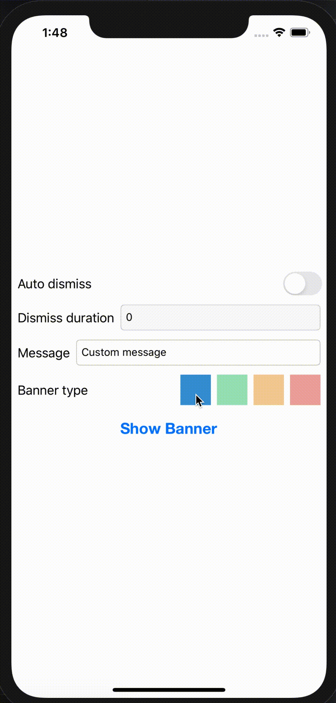
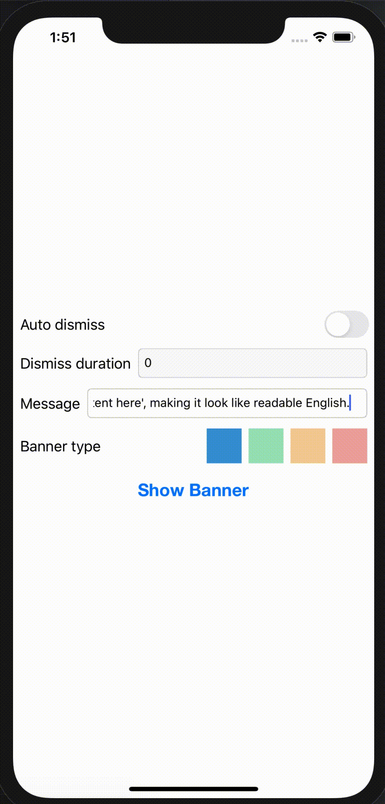
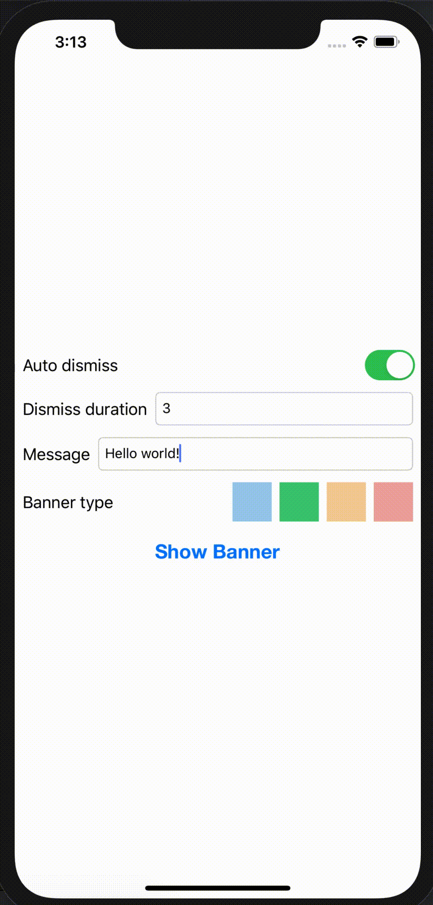

# iBanner
iBanner is a customizable and lightweight library that makes the task of displaying in app notification banners in iOS

## Highly customizable

| Basic Banners | Banners with different types |
| ------------- | ------------- |
|   |   | 

| Growing Banners | Custom Banners |
| ------------- | ------------- |
|   |  | 

## Features
- Highly customizable ✅
- iPhone, iPhoneX, & iPad Support ✅
- Orientation change support ✅
- Custom `UIView` support ✅
- Support for long titles/ subtitles ✅
- Auto dismiss support ✅

## Requirements
 - iOS 11.0+
 - Xcode 11.0+
 
## Installation

### CocoaPods

iBanner is available through [CocoaPods](http://cocoapods.org). To install
it, simply add the following line to your Podfile:

#### Swift 5 + xCode 11 + iOS 13 Support

```ruby
pod 'iBanner'
```
