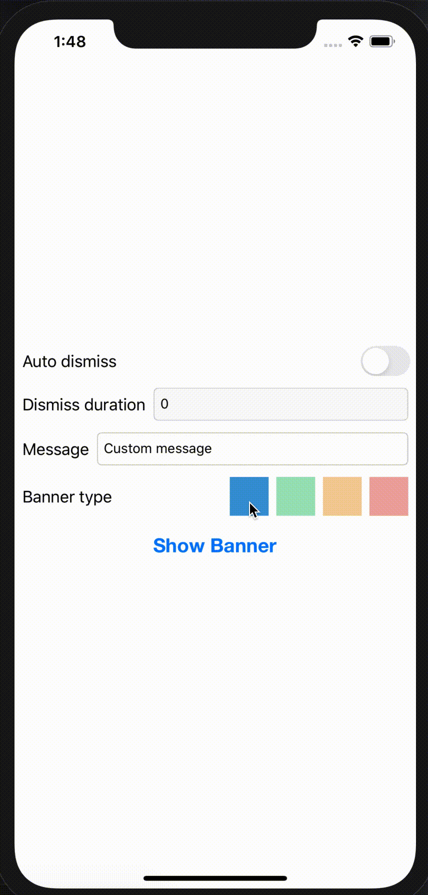
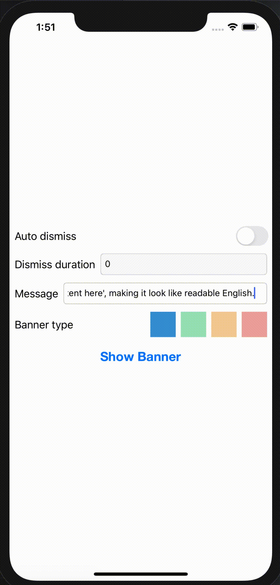
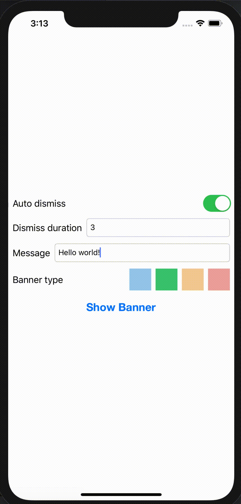

# iBanner
iBanner is a customizable and lightweight library that makes the task of displaying in app notification banners in iOS

## Highly customizable

| Basic Banners | Banners with different types |
| ------------- | ------------- |
|   |   | 

| Growing Banners | Custom Banners |
| ------------- | ------------- |
|   |  | 
